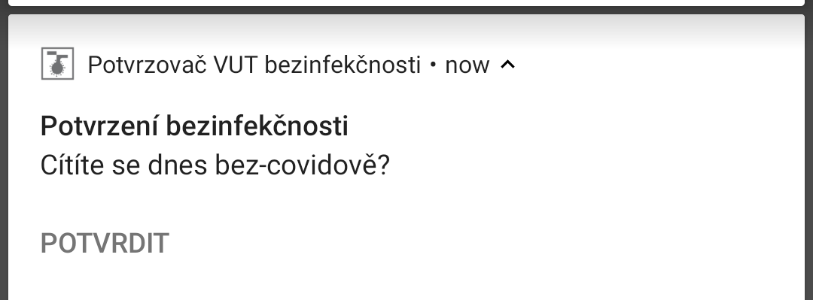

# VUT Covid potvrzovač bezinfekčnosti

Jednoduchá Android aplikace, která se přihlásí na VUT Intraportál a odklikne za Vás ten otravný formulář na potvrzení o bezinfekčnosti.

Aplikaci je taktéž možno nastavit tak aby ve vybrané dny ve vybraný čas zobrazovala notifikaci, která se Vás zeptá zda jste bez příznaků a nabídne Vám možnost bezinfekčnost potvrdit. Po zmáčknutí se otevře aplikace a automaticky se provede potvrzení formuláře.

Extrakce nějakých session ID je celkem nahardcoděná a závislá na HTML VUT tudíž je možné, že časem aplikace přestane fungovat.

| Hlavní obrazovka  | Nastavení notifikací |
| ------------- | ------------- |
|    |   |

Vzhled notifikace:

