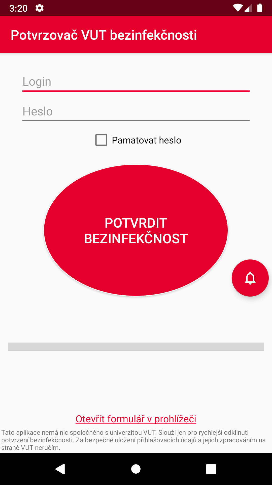
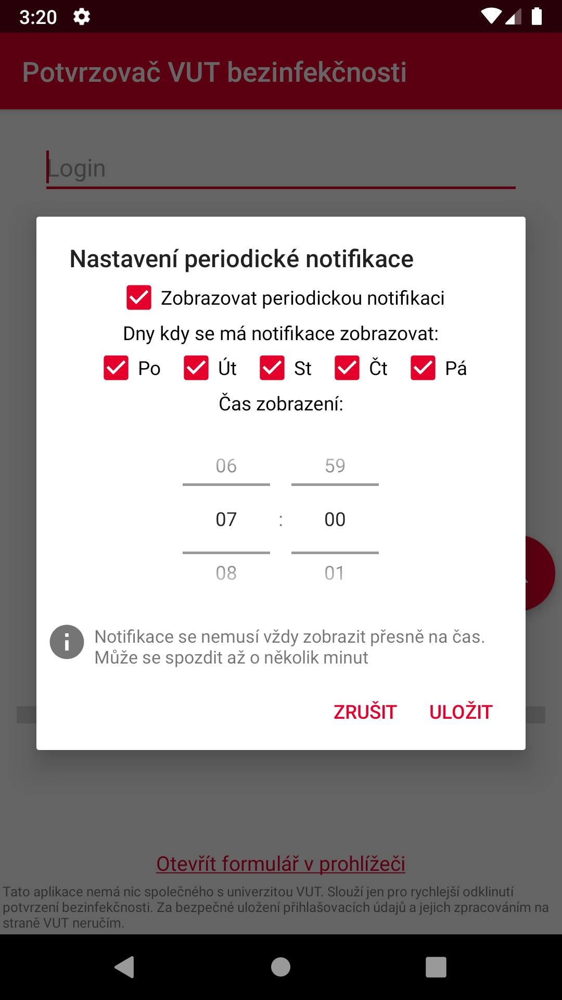

# VUT Covid potvrzovač bezinfekčnosti

Jednoduchá Android aplikace, která se přihlásí na VUT Intraportál a odklikne za vás ten otravný formulář na potvrzení o bezinfekčnosti.

Extrakce nějakých session ID je celkem nahardcoděná a závislá na HTML VUT tudíž je možné že časem aplikace přestane fungovat.
| Hlavní obrazovka  | Nastavení notifikací |
| ------------- | ------------- |
|    |   |

